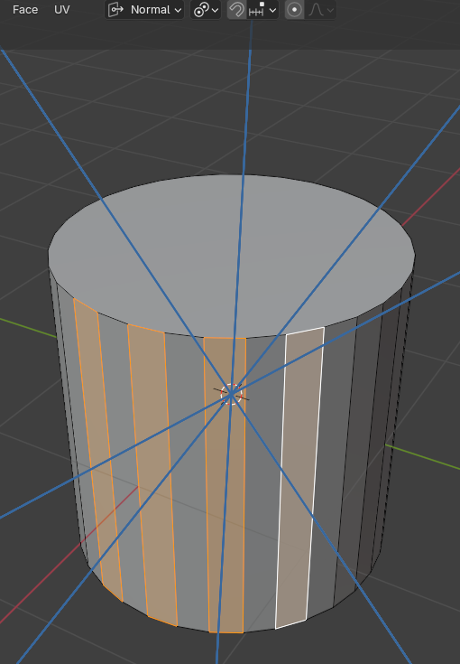

## 1 Почніть з клавіатурних скорочень

Чим раніше ви почнете користуватись клавіатурними скороченнями при моделюванні, тим краще. Хоча, насправді, в blender3d практично неможливо зробити модель без них :D.  
Ось декілька найуживаніших клавіатурних скорочень для 3d моделювання:
- Shift + A - застосування трансформації до об'єкту. (Дуже корисно коли модифікатори починають видавати спотворений результат)
- Ctrl + J -  Об'єднання декількох об'єктів в один в Object mode.
- P - Сепарація виділених частин моделі в окремий об'єкт
- Tab - перемикання режимів редагування.
- G + mouse - рухати модель у просторі
- G+Shift+x - рухати модель в площині yz. 
- Е - видавлювання

## 2 Вивчіть що таке точка, грань, полігон, нормаль, дотична(tangent)

## 3 Вивчіть що таке перетворення орієнтації об'єкта (transform orientation) і як ним користуватись.

Суть режиму заключається в зміні осей трансформації. Найбільше використовуються глобальний та локальний режими орієнтації об'єктів
Знання режимів орієнтації спрощує процес моделювання.

## 4 Вивчіть що таке  transform pivot point.

Вище зображено приклад використання transform pivot point
Щоб отримати такий же результат треба: налаштувати Transform orientation і transform pivot point вкладки, обрати потрібні полігони, затиснути G+Z.

## 5 Спрощуйте процес моделювання за допомогою модифікаторів.
- Subdivision surface - цей модифікатор збільшує кількість полігонів в моделі, згладжує гострі кути між полігонами.
- Curve - вигинає модель по сплайну
- Array - дублює модель по обраній осі з xyz
- Shinkwrap - умовно кажучи, "розтягує" обрану модель по поверхні іншої 3d моделі. Дуже зручно при моделюванні облягаючого одягу :D

